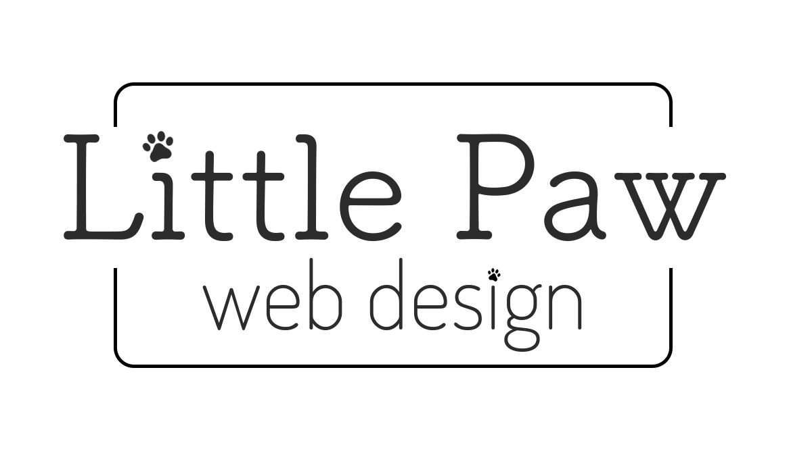
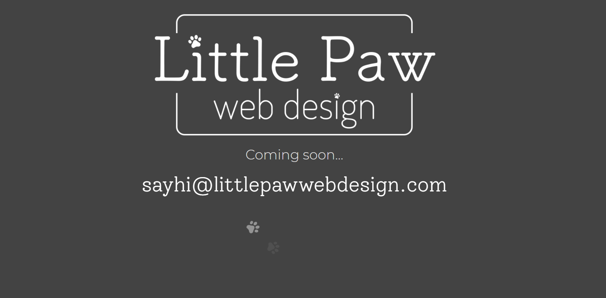

<h1 align="center">
   
  
   
  Intro LPWD
   
</h1>

<h4 align="center">Simple landing page to introduce Little Paw Web Design.</h4>

  <a href="#key-features">Key Features</a> •
  <a href="#project">Project</a> •
  <a href="#animation">Animation</a> •  
  <a href="#software">Software</a> •
  <a href="#contact">Contact</a>

## Key features

- Initial design built with Webflow.
- Nice big logo to clearly display company name.
- email to encourage visitors to say hi!
- cute animaltion with little paws walking across screen.
- Nothing too fancy, it's just a landing page.

## Project

The project can be viewed here:

[https://lpwd-intro-page.webflow.io/](https://lpwd-intro-page.webflow.io/)

## Animation

Example of walking paws:

## Software

- [Webflow](https://webflow.com)

---

## Contact

> [littlepawwebdesign.com](https://www.littlepawwebdesign.com) &nbsp;&middot;&nbsp;
> GitHub [@littlepawwebdesign](https://github.com/littlepawwebdesign)
